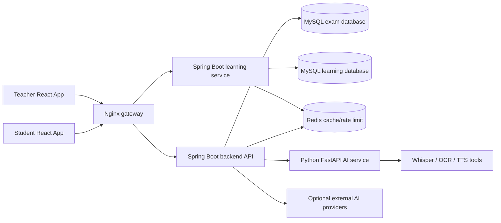
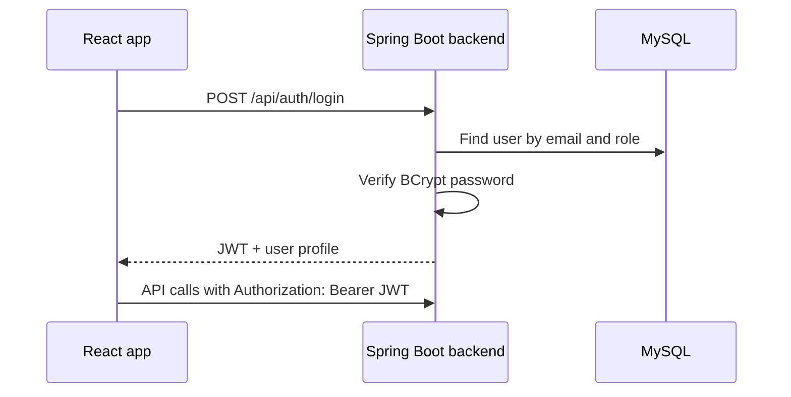
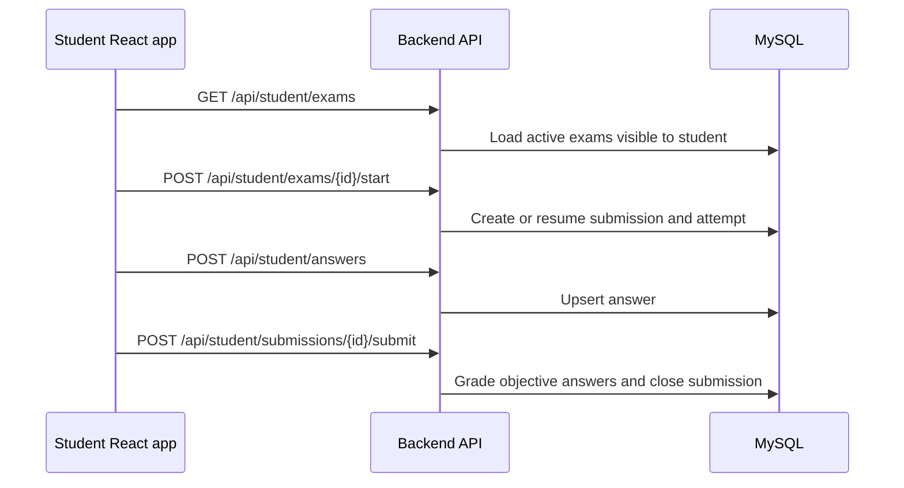
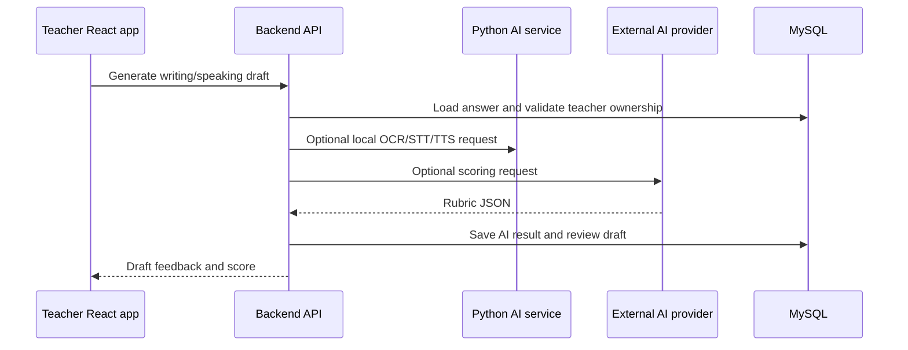
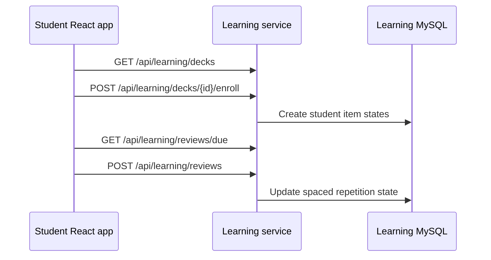

# Architecture

This document describes the architecture used for the graduation-project version
of AI English Tutor. The goal is a clear, maintainable hybrid system rather than
a fully production-grade distributed platform.

## Component Overview

## Architectural Style

The system uses a hybrid architecture:

- The main Spring Boot backend owns authentication, exams, submissions, media,
  scoring, and teacher analytics.
- The learning service is separated because vocabulary decks and spaced
  repetition have a different domain model and can evolve independently.
- The Python AI service is separated because OCR, TTS, and speech-to-text depend
  on Python libraries and native tools.
- React apps are split by user role: student and teacher/admin.

This is a practical middle ground for a graduation project: it demonstrates
service boundaries without requiring Kubernetes, service mesh, or complex
distributed operations.

## Main Request Flows

### Authentication

The learning service accepts the same JWT secret so student users can call
learning APIs after logging in through the main backend.

### Student Exam Flow

The backend enforces ownership and role access on the server side, so students
cannot read other students' submissions or inactive exams.

### AI-Assisted Grading Flow

The current graduation-project implementation uses synchronous HTTP calls with
timeouts and bounded executors. For production, this flow should move to a
queue-based job model.

### Learning Flow

## Backend Layering

Both Java services follow the same layering style:

- Controller: REST endpoints, validation entry point, role annotations.
- Service: business rules, transactions, access checks.
- Repository: JPA queries, projections, entity graphs.
- DTO: request and response models exposed to frontend.
- Entity: database mapping, kept separate from API responses.

## Data Stores

The main backend uses the `ai_english_exam` database. Important domains include:

- users, roles, students, teachers
- classes and class_students
- exams, exam_sections, questions, question_options
- submissions, answers, scores, feedbacks
- media_files, ai_results, ai_scoring_logs

The learning service uses the `ai_english_learning` database:

- decks
- vocabulary_items
- student_deck_enrollments
- student_item_state
- flashcard_reviews

Flyway migrations are used in both services so the schema is reproducible.

## Security Model

- JWT authentication is stateless.
- Spring Security protects all non-public APIs.
- Role authorization is implemented with `@PreAuthorize` and service-level
  ownership checks.
- CORS origins are configured by environment variable.
- File uploads validate size, MIME type, and file magic where relevant.
- Rate limiting can use Redis in Docker/prod-like mode.

For the graduation project, JWT is stored in browser localStorage for simplicity.
For production, HttpOnly Secure cookies or a refresh-token model are recommended.

## Operational View

The Docker Compose stack includes:

- backend
- learningservice
- aiservice
- nginx
- redis
- prometheus
- optional mysql profile

This is enough for local demonstration and defense. Full production would add
HA databases, object storage, centralized logs, alerting, and rolling deploys.

## Known Non-Production Limits

- AI processing is synchronous HTTP rather than a durable job queue.
- Uploads are stored on local/bind-mounted disk.
- Docker Compose runs one instance of each service by default.
- CI/CD is intentionally lightweight for the graduation-project scope.
