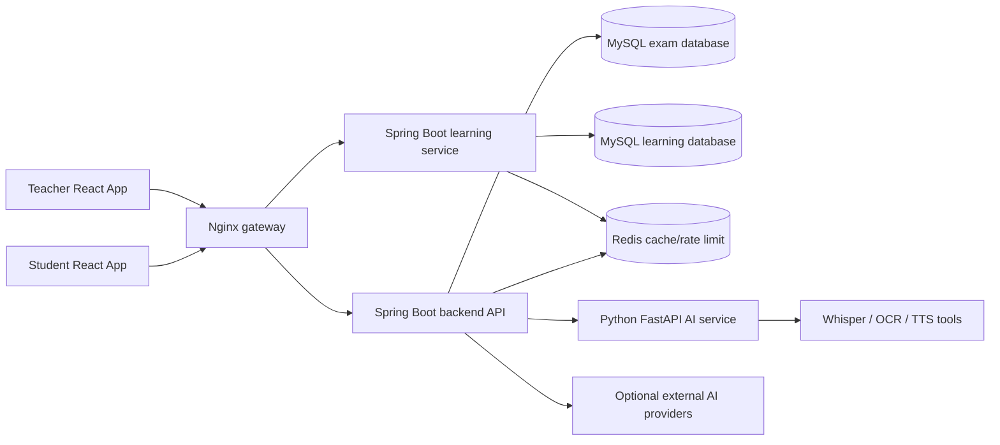
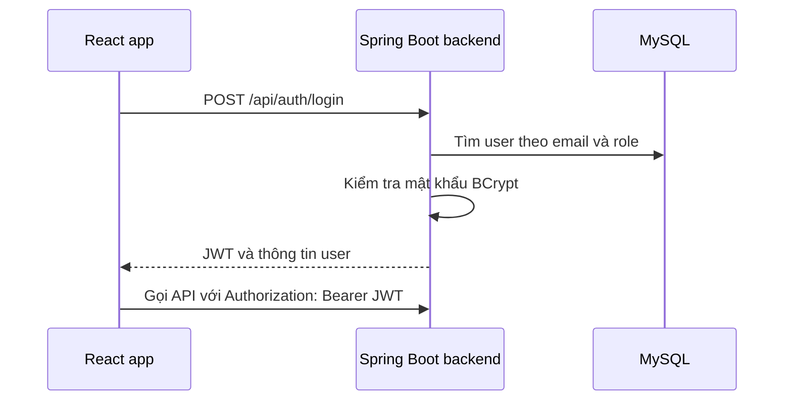
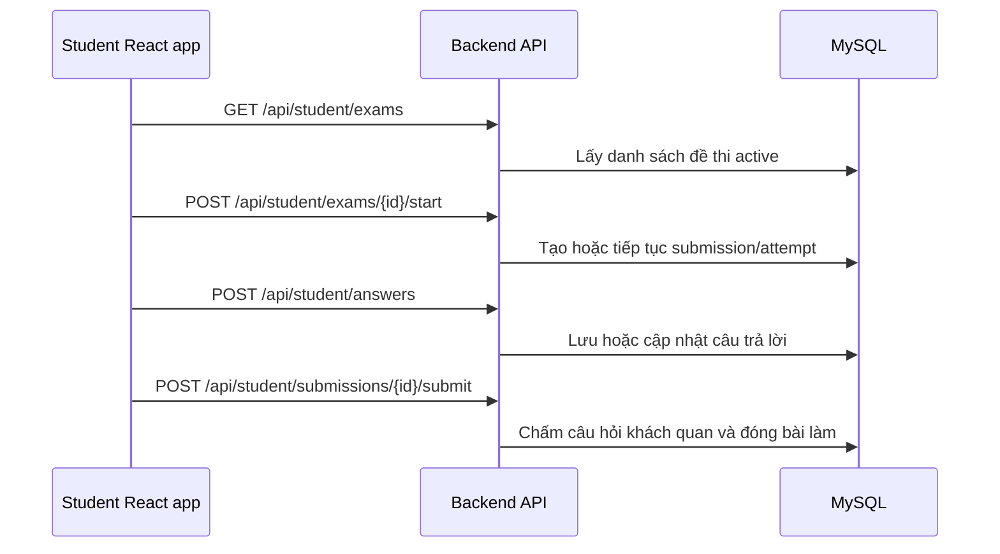
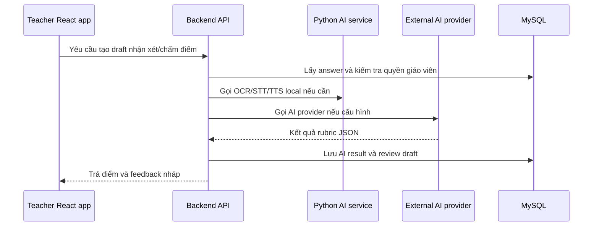
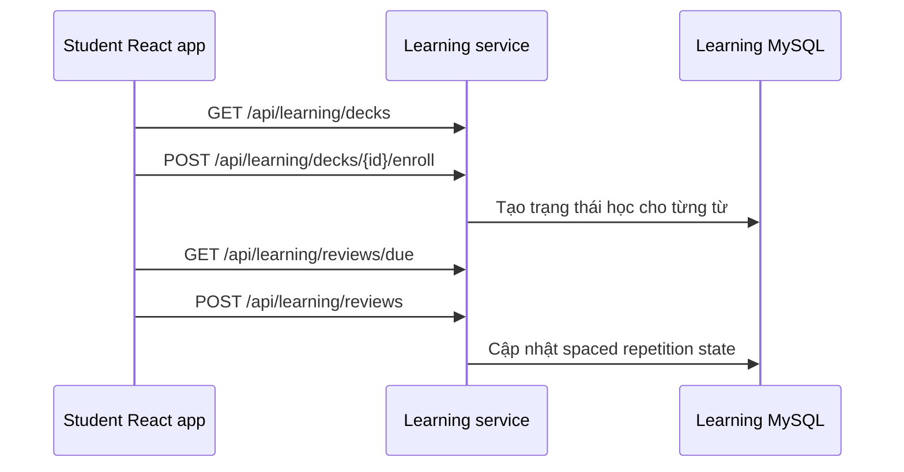

# Kiến Trúc Hệ Thống

Tài liệu này mô tả kiến trúc của AI English Tutor ở phạm vi khóa luận tốt
nghiệp. Mục tiêu là xây dựng một hệ thống rõ ràng, dễ bảo trì, có tư duy thiết
kế enterprise ở mức phù hợp, chưa hướng tới triển khai production phức tạp.

## Tổng Quan Thành Phần

## Mô Hình Kiến Trúc

Hệ thống sử dụng kiến trúc hybrid:

- Backend chính Spring Boot quản lý xác thực, đề thi, bài làm, media, chấm điểm
  và thống kê cho giáo viên.
- Learning service được tách riêng vì nghiệp vụ học từ vựng và spaced
  repetition có mô hình dữ liệu riêng, có thể phát triển độc lập.
- AI service dùng Python vì OCR, TTS và speech-to-text phụ thuộc nhiều vào thư
  viện Python và công cụ native.
- Frontend tách thành hai ứng dụng React theo vai trò: sinh viên và giáo viên.

Mô hình này phù hợp với khóa luận: thể hiện được tư duy chia miền nghiệp vụ
nhưng không làm hệ thống quá nặng như microservices production đầy đủ.

## Các Luồng Chính

### Luồng Đăng Nhập

Learning service dùng cùng JWT secret để sinh viên có thể truy cập API học từ
vựng sau khi đăng nhập qua backend chính.

### Luồng Làm Bài Thi

Backend kiểm tra quyền sở hữu ở phía server, vì vậy sinh viên không thể xem bài
làm của sinh viên khác hoặc đề thi chưa được mở.

### Luồng AI Hỗ Trợ Chấm Điểm

Ở phạm vi khóa luận, hệ thống dùng HTTP đồng bộ với timeout và bounded executor.
Khi triển khai production, luồng này nên chuyển sang mô hình job queue.

### Luồng Học Từ Vựng

## Phân Tầng Backend

Hai service Java dùng cùng phong cách phân tầng:

- Controller: định nghĩa REST endpoint, nhận request, gọi service.
- Service: xử lý nghiệp vụ, transaction, kiểm tra quyền.
- Repository: truy vấn JPA, projection, entity graph.
- DTO: request/response model trả cho frontend.
- Entity: ánh xạ bảng cơ sở dữ liệu, tách khỏi dữ liệu API.

## Cơ Sở Dữ Liệu

Backend chính dùng database `ai_english_exam`, gồm các nhóm bảng:

- users, roles, students, teachers
- classes, class_students
- exams, exam_sections, questions, question_options
- submissions, answers, scores, feedbacks
- media_files, ai_results, ai_scoring_logs

Learning service dùng database `ai_english_learning`, gồm:

- decks
- vocabulary_items
- student_deck_enrollments
- student_item_state
- flashcard_reviews

Cả hai service đều dùng Flyway migration để schema có thể tái tạo và kiểm soát
phiên bản.

## Bảo Mật

- Xác thực bằng JWT stateless.
- Spring Security bảo vệ các API không public.
- Phân quyền bằng `@PreAuthorize` và kiểm tra ownership ở tầng service.
- CORS cấu hình bằng biến môi trường.
- Upload file kiểm tra kích thước, MIME type và magic bytes.
- Rate limiting có thể dùng Redis trong môi trường Docker/prod-like.

Trong phạm vi khóa luận, JWT được lưu trong localStorage để đơn giản demo. Khi
triển khai production, nên chuyển sang HttpOnly Secure cookie hoặc mô hình
refresh token.

## Vận Hành Local

Docker Compose gồm:

- backend
- learningservice
- aiservice
- nginx
- redis
- prometheus
- mysql tùy chọn qua profile

Cấu hình này đủ cho demo và bảo vệ khóa luận. Production thực tế sẽ cần thêm HA
database, object storage, centralized logging, alerting và rolling deployment.

## Giới Hạn Chưa Production

- AI processing vẫn là HTTP đồng bộ, chưa có durable job queue.
- File upload lưu trên local/bind-mounted disk.
- Docker Compose mặc định chạy một instance cho mỗi service.
- CI/CD hiện ở mức nhẹ, phù hợp giai đoạn khóa luận.
